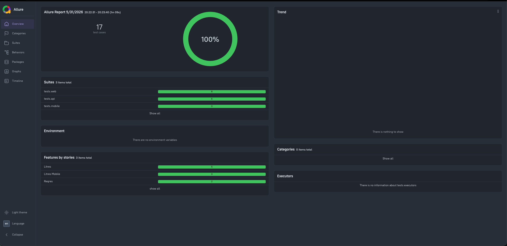
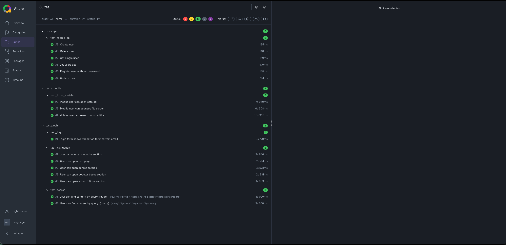
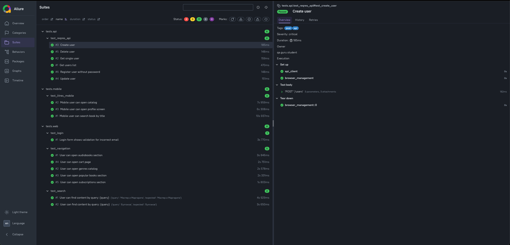
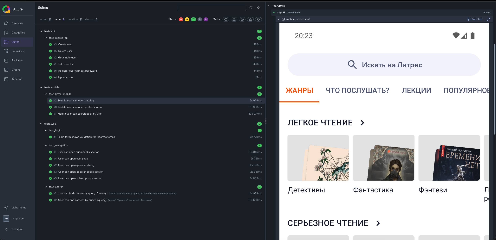
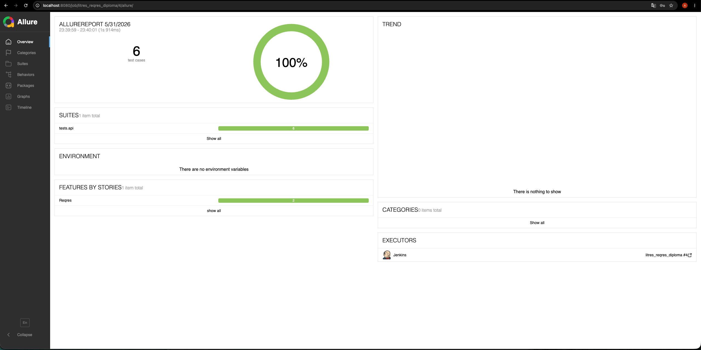

# Дипломный проект по автоматизации тестирования Litres + Reqres

Это учебный проект по автоматизации тестирования на Python.
В проекте есть WEB, API и MOBILE автотесты.

WEB-тесты проверяют сайт [Litres](https://www.litres.ru/), API-тесты работают с сервисом [Reqres](https://reqres.in/), MOBILE-тесты запускаются для Android-приложения Litres через Appium.

## Что есть в проекте

| Раздел | Количество тестов | Кратко |
| --- | ---: | --- |
| WEB | 8 | Поиск, навигация, корзина, подписка, авторизация |
| API | 6 | Получение, создание, обновление и удаление пользователя |
| MOBILE | 3 | Поиск, раздел жанров, экран входа |

Списки тестов отдельно описаны здесь:

- [WEB тесты](tests/web/ui_tests.md)
- [API тесты](tests/api/api_tests.md)
- [MOBILE тесты](tests/mobile/mobile_tests.md)
- [Ручные кейсы](docs/testops_manual_cases.md)

## Используемые инструменты

- Python 3.11
- Pytest
- Selenium / Selene
- Requests
- Pydantic
- JsonSchema
- Appium
- Allure Report
- Jenkins

## Структура проекта

```text
litres_reqres_diploma/
├── litres_reqres_diploma/
│   ├── api/                 # API-клиент
│   ├── config/              # настройки проекта
│   ├── data/schemas/        # JSON-схемы для API
│   ├── models/              # модели для API
│   ├── pages/               # Page Object
│   ├── resources/           # тестовые данные
│   └── utils/               # вспомогательные функции
├── tests/
│   ├── api/
│   ├── mobile/
│   └── web/
├── docs/
├── Jenkinsfile
├── requirements.txt
├── pyproject.toml
├── .env.example
└── README.md
```

## Установка

Создать и активировать виртуальное окружение:

```bash
python3.11 -m venv .venv
source .venv/bin/activate
```

Установить зависимости:

```bash
pip install -r requirements.txt
```

Создать файл `.env`:

```bash
cp .env.example .env
```

В `.env` нужно указать ключ Reqres:

```env
REQRES_API_KEY=your_reqres_api_key
```

Файл `.env` не добавляется в GitHub, потому что в нем хранятся локальные настройки и ключи.

## Запуск тестов

WEB и API:

```bash
pytest tests/web tests/api
```

Только WEB:

```bash
pytest tests/web
```

Только API:

```bash
pytest tests/api
```

MOBILE:

```bash
RUN_MOBILE=true pytest tests/mobile
```

Все тесты вместе:

```bash
RUN_MOBILE=true pytest
```

Без переменной `RUN_MOBILE=true` мобильные тесты пропускаются, чтобы проект можно было запускать без Appium и эмулятора.

## Mobile

Для mobile-тестов нужен запущенный Appium Server и Android-эмулятор с установленным приложением Litres.

Проверка эмулятора:

```bash
~/Library/Android/sdk/platform-tools/adb devices
```

Проверка приложения:

```bash
~/Library/Android/sdk/platform-tools/adb shell pm list packages | grep litres
```

Запуск Appium Server:

```bash
ANDROID_HOME=$HOME/Library/Android/sdk ANDROID_SDK_ROOT=$HOME/Library/Android/sdk appium --base-path /
```

После этого можно запускать mobile-тесты:

```bash
RUN_MOBILE=true pytest tests/mobile
```

## Основные настройки

Основные переменные лежат в [.env.example](.env.example).

Чаще всего нужны:

- `WEB_BASE_URL` - адрес сайта Litres;
- `API_BASE_URL` - адрес Reqres API;
- `REQRES_API_KEY` - ключ Reqres;
- `RUN_MOBILE` - запуск mobile-тестов;
- `MOBILE_REMOTE_URL` - адрес Appium Server;
- `MOBILE_APP_PACKAGE` - package Android-приложения;
- `MOBILE_APP_ACTIVITY` - стартовая activity Android-приложения.

## Allure Report

Запуск тестов с сохранением результатов:

```bash
RUN_MOBILE=true pytest --alluredir=allure-results
```

Открыть отчет:

```bash
allure serve allure-results
```

Пример полного локального запуска:



Группировка тестов по разделам:



Пример API-теста:



Пример mobile-теста со скриншотом приложения:



## Jenkins

В проекте есть [Jenkinsfile](Jenkinsfile).

Для Jenkins добавлен Pipeline из `Jenkinsfile`. Локально был проверен запуск Pipeline from SCM: Jenkins берет код из GitHub, создает виртуальное окружение, устанавливает зависимости, запускает выбранный набор тестов и публикует Allure Report.

Для Jenkins используются параметры:

- `TEST_SCOPE` - выбор набора тестов: `web_api`, `web`, `api`, `mobile`;
- `REQRES_API_KEY` - ключ Reqres для API-тестов;
- `RUN_MOBILE` - запуск mobile-тестов;
- `MOBILE_CONTEXT` - локальный запуск или BrowserStack.

Пример Allure Report в Jenkins:



## Результат локального запуска

Проект был проверен командой:

```bash
RUN_MOBILE=true .venv/bin/python -m pytest -q
```

Результат:

```text
17 passed
```
